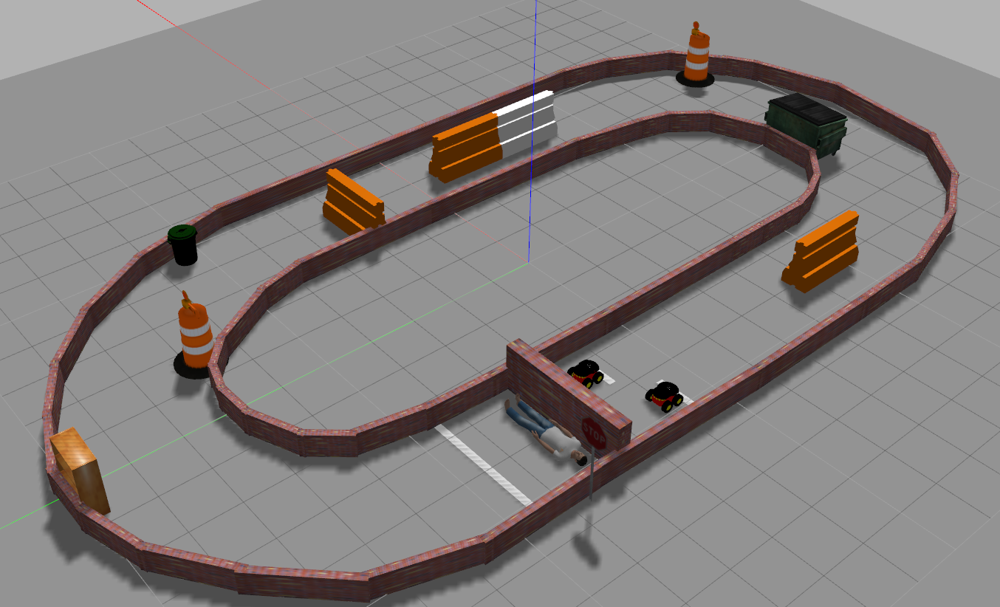

# Roboweek Challenge

This repository contains a rough kinematic algorithm developed by me (UFSM, NTNU) and [Guilherme Christmann](https://github.com/guichristmann) (UFSM, NTNU) for the purpose of a 24h robotics competition held in Brazil, in 2018.

> Challenge: development of an algorithm for a laser-guided TurtleBot within a maze environment.

# Award

Second place medal awarded to overall individual team winner of a 24h robotics competition (RoboWeek) at the Federal University of Rio Grande (FURG), Brazil.
Event Website: http://roboweek.c3.furg.br/

# Instructions
To reproduce the simulation, kindly access [this link](https://drive.google.com/drive/folders/1rIWDC9wHPcT_eNRiRx-XcyBCDKqV4Xsh) for instructions on how to operate the Gazebo simulator with ROS.

Below is our TurtleBot completing the entire circuit and leading position in the second to last race. Our implementation was able to complete the entire labyrinth. However, in the finals, our bot slammed into another, consequently overturning, and so we got second place overall according to the distance criteria from the finish line.

# Author

Created and maintained by [@camponogaraviera][1].

[1]: https://github.com/camponogaraviera

# License

This work is licensed under a [Creative Commons Zero Attribution v1.0 Universal](LICENSE) license.
